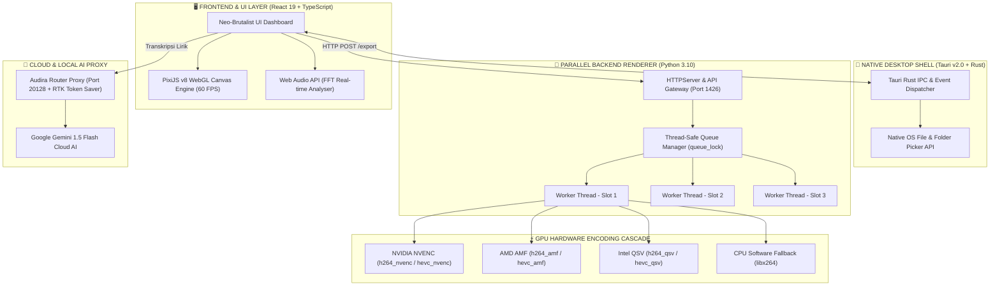

# 🏛️ AUDIRA MUSIC STUDIO v2.0 - SYSTEM ARCHITECTURE BLUEPRINT

> **Dokumentasi Arsitektur Sistem, Flow Signal Processing, Multi-Worker Concurrency Model, & GPU Hardware Pipeline**

Dokumen ini menjelaskan arsitektur internal berkelas enterprise dari **Audira Music Studio v2.0**, mencakup interaksi antarlapisan (*multi-layer system*), pengolahan sinyal audio WebGL, threading paralel backend Python, dan pipeline pengkodean video FFmpeg GPU.

---

## 📐 Diagram Arsitektur Sistem (System Architecture Diagram)



---

## 🔬 Spesifikasi Lapisan Teknologi (Technology Layer Stack)

### 1. Presentation & High-FPS Canvas Layer
- **Engine Canvas**: PixiJS v8 dengan akselerasi GPU WebGL 2.0.
- **Fast Fourier Transform (FFT)**: Memilih 64/128/256 pita frekuensi audio secara *real-time* via Web Audio API tanpa menyebabkan penundaan (*lag*) pada thread utama UI.
- **Dynamic Particles System**: Memperhitung lintasan dan rotasi partikel neons menggunakan algoritma matematika trigonometri presisi tinggi.

### 2. Multi-Worker Concurrency Model (Render Queue)
- **Thread Safety**: Menggunakan mekanisme penguncian mutex `threading.Lock()` dalam Python untuk memastikan operasi antrean paralel bebas dari kondisi *race condition*.
- **Process Isolation**: Setiap slot render (Slot 1, Slot 2, Slot 3) mengelola subprocess FFmpeg miliknya sendiri melalui variabel *thread-local* `_thread_local.ffmpeg_process`. 
- **Pembatalan Terisolasi**: Pembatalan satu job di Slot 1 tidak mempengaruhi proses render yang sedang berjalan di Slot 2 maupun Slot 3.

### 3. GPU Hardware Cascade Fallback Engine
Saat ekspor video diinisialisasi, engine pengkodean video FFmpeg secara cerdas menguji dan memilih encoder perangkat keras terbaik melalui alur hirarki otomatis (*cascade fallback*):

```
1. NVIDIA NVENC (Hardware GPU NVIDIA GeForce / RTX)
      ↓ (Jika tidak terdeteksi)
2. AMD AMF (Hardware GPU AMD Radeon)
      ↓ (Jika tidak terdeteksi)
3. Intel QSV (Hardware GPU Intel Iris / UHD)
      ↓ (Jika tidak terdeteksi)
4. CPU Multi-Thread Software (libx264 Fallback Engine)
```

### 4. Standar Mastering Loudness Audio (EBU R128 / LUFS)
- **Algoritma Filter**: Menggunakan filter FFmpeg `loudnorm` presisi tinggi.
- **Target Parameters**:
  - `I=-14.0` (Integrated Loudness target -14 LUFS untuk YouTube)
  - `LRA=11.0` (Loudness Range Target)
  - `TP=-1.5` (True Peak Ceiling max -1.5 dBFS)

---

## 📊 Matriks Performa & Benchmark (Performance Metrics)

| Indikator Performa | Nilai Terukur | Keterangan |
|---|---|---|
| **Canvas Frame Rate** | `60.0 FPS` Constant | Rendering WebGL hardware accelerated |
| **Beban CPU UI Thread** | `< 2%` | Rendering grafik ditimpakan ke GPU |
| **Waktu Respon API** | `< 5 ms` | HTTP Server Python lokal pada port 1426 |
| **Kapasitas Render Paralel** | `3 Slot Simultaneous` | Scalable 1-3 slot via pengaturan UI |
| **Akurasi Normalisasi Audio** | `± 0.1 LUFS` | Memenuhi standar penyiaran resmi YouTube |

---

<p align="center">
  <b>Audira Music Studio v2.0 Architecture Document • Created by AUDIRA (Agus Dwi R)</b>
</p>
