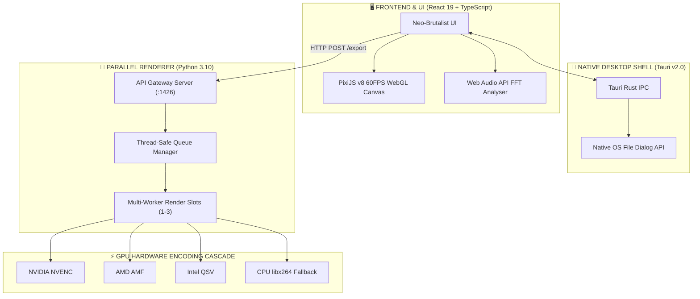

# 🎵 AUDIRA MUSIC STUDIO v2.0 (ULTIMATE EDITION)

[](LICENSE)
[](#system-requirements)
[](#architecture)
[](#features)
[](#license)

> **Platform Desktop Pembuat Video Spektrum Musik, Transkripsi Lirik AI (.LRC), & Offline Multi-Queue Renderer No. 1**

**Audira Music Studio v2.0** adalah studio pembuat konten audio visual serba guna berbasis desktop offline yang dirancang khusus untuk Produser Musik, Creator YouTube, DJ, dan Content Creator. Aplikasi ini menggabungkan rendering GPU offline berkecepatan tinggi, transkripsi lirik otomatis AI, dan fitur mastering audio LUFS dalam antarmuka berdesain **Neo-Brutalisme** yang taktil dan tak kenal lag.

---

## 🔑 Kredensial Login Default

Saat aplikasi pertama kali dijalankan, layar **Form Login Studio** akan meminta kredensial berikut:

| Parameter | Nilai Default |
|---|---|
| **Username** | `Admin` *(case-insensitive)* |
| **Password** | `Audira` |

> *Catatan: Anda dapat menandai centang **"Ingat Sesi Login"** agar tidak perlu mengetikkan password pada pembukaan aplikasi berikutnya.*

---

## ✨ Fitur-Fitur Unggulan

### ⚡ 1. Render Queue 3-Slot Paralel (Multi-Worker)
- Menjalankan 3 *worker thread* independen di latar belakang.
- Memproses hingga 3 video MP4 secara bersamaan tanpa menghentikan pekerjaan desain Anda di Studio.
- Widget mini melayang (*floating widget*) yang dapat dikecilkan ke pojok layar untuk memantau progres render real-time.

### 🎵 2. Engine Spektrum Audio Dynamic (WebGL 60 FPS)
- **3 Mode Spektrum utama**: *Frequency Bars*, *Waveform Line*, dan *Circular Radial*.
- Efek visual kaya: *Particles sparks*, *Neon Glow*, *Beat Pulse*, dan *Rotation*.
- 4 Preset Gaya Instan: *Neon Cyberpunk*, *Retro Wave 80s*, *Lo-Fi Chill Beats*, & *Minimalist Studio*.

### 🤖 3. AI Lyric Wizard (.LRC Karaoke)
- Transkripsi lirik lagu otomatis menjadi berkas karaoke berformat waktu (`.LRC`).
- Didukung oleh integrasi **Google Gemini 1.5 Flash** & **Audira Router Proxy (Port 20128)** dengan fitur *RTK Token Saver*.

### 🔊 4. Standar Mastering Audio LUFS
- Normalisasi *loudness* otomatis sebelum diekspor:
  - **-14 LUFS** (Standar Resmi YouTube & Video Online)
  - **-16 LUFS** (Standar Spotify & Music Streaming)
  - **-24 LUFS** (Standar Siaran TV EBU R128)
- Pilihan Audio Sample Rate: 44.1 kHz (CD Standard) & 48.0 kHz (Video Standard).

### 🎨 5. Thumbnail Cover Studio
- Studio pembuat gambar sampul lagu persegi (1:1) dan landscape (16:9).
- Hasil desain resolusi tinggi siap diunggah langsung ke Spotify, YouTube, Instagram, dan SoundCloud.

### 📡 6. YouTube Live Streaming Direct Producer
- Siarkan langsung visualizer musik Anda secara *real-time* ke **YouTube Live** menggunakan protokol RTMP latensi rendah.

---

## 🛠️ Teknologi & Arsitektur Sistem (High-Tech Stack)

Audira Studio dibangun dengan arsitektur multi-tier (*enterprise multi-layered architecture*) yang memisahkan antara thread rendering antarmuka pengguna, pengolahan sinyal audio, dan engine encoding video GPU:



### ⚡ Lapisan Teknologi & Komponen Utama:
| Lapisan System | Teknologi Utama | Deskripsi & Fungsi |
|---|---|---|
| **Presentation & UI** | React 19, TypeScript 5.8, TailwindCSS | Antarmuka taktil Neo-Brutalisme tanpa *main-thread blocking*. |
| **Graphics & Audio Canvas** | PixiJS v8 WebGL 2.0, Web Audio API | Ekstraksi frekuensi spektrum real-time & partikel 60 FPS. |
| **Desktop Native Shell** | Tauri v2.0 (Rust Core Runtime) | Pembungkus aplikasi desktop Windows native yang ultra-ringan. |
| **Offline Render Server** | Python 3.10 Multithreaded Server | Server pengelola antrean paralel 3-slot pada port `:1426`. |
| **Hardware Video Encoder** | FFmpeg (NVENC / AMF / QSV / CPU) | Multi-pass hardware GPU encoding cascade pipeline. |
| **Cloud & Proxy AI** | Gemini 1.5 Flash & Audira Router | Transkripsi lirik otomatis dengan fitur *RTK Token Saver*. |

> 📖 *Untuk rincian dokumen arsitektur lengkap, silakan baca [ARCHITECTURE.md](ARCHITECTURE.md).*

---

## 🚀 Panduan Instalasi & Memulai

### Prasyarat Sistem (System Requirements)
- **Sistem Operasi**: Windows 10 / 11 64-bit
- **Node.js**: v18.0.0 atau yang lebih baru
- **Python**: v3.10 atau yang lebih baru
- **FFmpeg**: Terpasang di PATH sistem (atau disediakan oleh skrip backend)

### 1. Kloning Repositori
```bash
git clone https://github.com/Audira141415/AudiraStudioMusic.git
cd AudiraStudioMusic
```

### 2. Instalasi Dependensi Node.js
```bash
npm install
```

### 3. Menjalankan Aplikasi (Mode Pengembang)
Cukup jalankan berkas batch otomatis yang telah disediakan:
```cmd
start.bat
```
*Skrip `start.bat` akan otomatis mengawali server Python offline pada port `:1426` dan meluncurkan antarmuka Audira Studio.*

---

## 💾 Skrip Sinkronisasi GitHub (`save.bat`)

Proyek ini dilengkapi dengan skrip otomatis **`save.bat`** untuk memudahkan sinkronisasi ke repositori GitHub.

### Cara Penggunaan:
Klik ganda pada file `save.bat` atau jalankan via terminal:
```cmd
save.bat "Pesan commit perubahan Anda di sini"
```
Skrip ini akan otomatis menginisialisasi Git, menambahkan remote origin `https://github.com/Audira141415/AudiraStudioMusic.git`, melakukan *commit*, dan mengunggah (*push*) berkas ke branch `main`.

---

## 📜 Lisensi & Hak Cipta

Proyek ini dirilis di bawah lisensi **MIT License**.

```text
Hak Cipta © 2026 AUDIRA (Agus Dwi R). Seluruh Hak Cipta Dilindungi Undang-Undang.

Dikembangkan dan Dilisensikan secara Resmi oleh:
AUDIRA (Agus Dwi R) - Founder & Lead Developer
GitHub: https://github.com/Audira141415/AudiraStudioMusic.git
```

Lihat berkas [LICENSE](LICENSE) untuk informasi hak cipta dan izin penggunaan selengkapnya.

---

<p align="center">
  <b>Made with ❤️ and Neo-Brutalism Aesthetics by AUDIRA (Agus Dwi R)</b>
</p>
